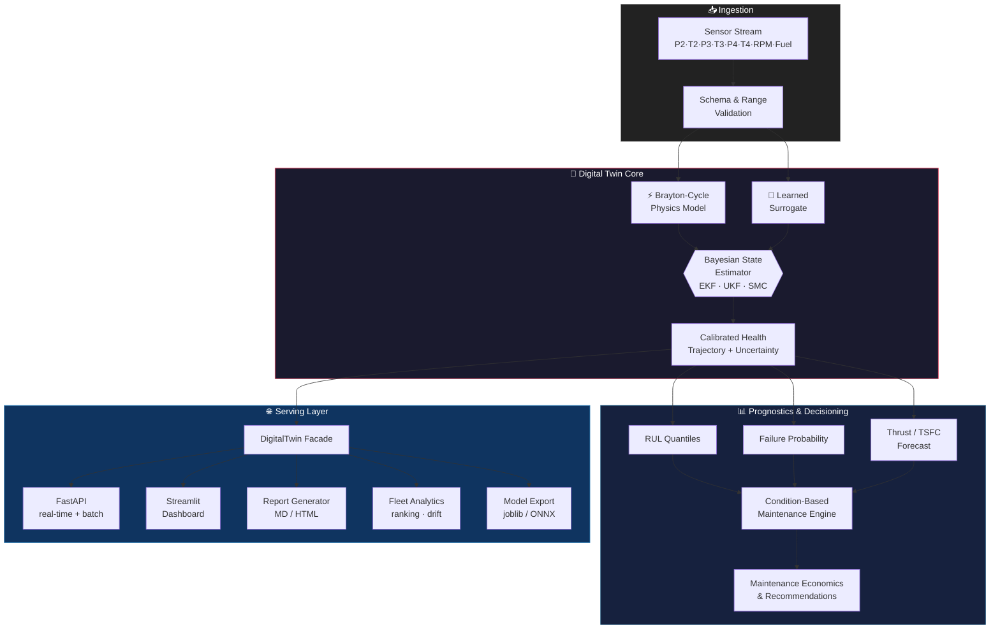

<div align="center">

# ⚙️ Turbojet Digital Twin

**Physics-informed digital twin for real-time four-stage turbojet health monitoring, RUL prediction, and fleet-scale condition-based maintenance.**

[](pyproject.toml)
[](LICENSE)
[](src/api/server.py)
[](src/viz/dashboard.py)
[](Dockerfile)
[](tests)
[](pyproject.toml)

[Overview](#overview) · [Architecture](#architecture) · [Quick Start](#quick-start) · [API](#api-reference) · [Project Layout](#project-layout) · [Deployment](#deployment) · [Testing](#testing--quality)

</div>

---

## Overview

This repository implements a **production-oriented digital twin** for a four-stage turbojet engine. It fuses a physically constrained Brayton-cycle model with a learned surrogate through Bayesian state estimation, producing calibrated health trajectories that drive remaining-useful-life (RUL) prediction, failure-risk scoring, and condition-based maintenance recommendations — for a single engine or an entire fleet.

| Capability | Description |
|---|---|
| 🔥 **Physics core** | Brayton-cycle thermodynamic reconstruction with conservation-law residuals |
| 📡 **State estimation** | EKF, UKF, and sequential Monte Carlo (particle filter) estimators |
| 🧠 **Learned surrogate** | Multi-output health/performance regression with model selection, trained on physics-residual features (measured vs. healthy-engine-predicted station values) alongside raw sensors |
| 📏 **Uncertainty** | Conformal prediction + MC-dropout + ensemble calibration |
| ⏳ **Prognostics** | RUL quantiles, failure probability, thrust & fuel-efficiency forecasts |
| 🛠️ **Maintenance** | CBM scheduler, economic optimization, actionable recommendations |
| 🚦 **Fleet ops** | Cross-engine ranking, drift monitoring, comparative analytics |
| 🌐 **Serving** | Stateful real-time + batch FastAPI service, Streamlit dashboard, HTML/MD reports |
| 🧪 **What-if simulator** | Adjust fuel flow, RPM, ambient conditions, component efficiency, sensor noise; instant before/after comparison |
| ⚠️ **Fault injection** | Compressor fouling, turbine erosion, fuel nozzle blockage, bearing wear, sensor drift/bias — propagated through physics → estimator → health → RUL → maintenance |
| 🔍 **Root cause analysis** | Ranked contributing factors and causal-chain explanations behind a health/RUL change; SHAP integration for ML-model predictions when installed |
| 💡 **Maintenance decision engine** | Multiple ranked maintenance options (monitor → inspect → repair → overhaul → replace) scored on cost, downtime, risk, and expected RUL gain |

---

## Architecture



**Design principle:** every consumer (CLI, API, dashboard, fleet workflows) talks to one shared `DigitalTwin` facade — physics and learning stay decoupled, state stays JSON-safe, and models/reports are versioned artifacts.

---

## Dashboard Preview

<div align="center">

| Live Health Gauge | Feature Importance |
|---|---|
|  |  |

| Health Trajectories | Thrust / TSFC Trends |
|---|---|
|  |  |

| RUL & Failure Probability | Maintenance Recommendation |
|---|---|
|  |  |

</div>

- **Overall Health Gauge** — real-time composite health score, thrust, RUL, and risk tier at a glance.
- **Feature Importance** — surrogate model attribution across sensor inputs (`FuelFlow` and `RPM` dominate).
- **Health Trajectories** — per-component (`Compressor`, `Combustor`, `Turbine`) and `OverallHealth` decay across cycles for the full fleet.
- **Thrust / TSFC Trends** — thrust output and thrust-specific fuel consumption tracked per cycle.
- **RUL & Failure Probability** — remaining-useful-life forecast vs. rising failure probability per engine.
- **Maintenance Recommendation** — CBM engine's actionable output (e.g. *"Continue normal operation — Risk level: low"*).

---

## Quick Start

```powershell
# 1. Environment
python -m venv .venv
.venv\Scripts\pip install -e ".[dev,api,dashboard,reports]"

# 2. Smoke-test the full pipeline
python pipeline.py demo
pytest

# 3. Serve
uvicorn src.api.server:app --reload          # REST API  → http://localhost:8000
streamlit run src/viz/dashboard.py           # Dashboard → http://localhost:8501
```

**Train → Predict:**

```bash
python pipeline.py train   --data path/to/data.csv --kind extra_trees --output models/best_model.joblib --strategy official
python pipeline.py predict --data path/to/data.csv --model models/best_model.joblib
python pipeline.py evaluate --data path/to/data.csv --model models/best_model.joblib
```

`--strategy official` (default) holds out a fraction of each engine's own cycles, matching the officially distributed `train.csv`/`test.csv` — use this for metrics comparable to how submissions are graded. `--strategy grouped` holds out entire engines instead, a harder generalization stress test not used by the official evaluation.

Artifacts land in `models/` and `results/`. CSV schema is defined in [`docs/DATA.md`](docs/DATA.md). All stochastic workflows are seeded (`config.yaml → seed`); optional accelerators (`xgboost`, `torch`, `onnx`) degrade cleanly if not installed.

---

## API Reference

Base URL: `http://localhost:8000`

| Method | Endpoint | Purpose |
|---|---|---|
| `GET` | `/health` | Liveness / readiness probe |
| `POST` | `/v1/engines/{engine_id}/update` | Push a single sensor reading, get updated health state |
| `POST` | `/v1/engines/{engine_id}/batch` | Push a batch of cycles for one engine |
| `POST` | `/v1/scenarios/simulate` | What-if simulation: before/after health, RUL, risk, thrust, TSFC, confidence + root cause |
| `POST` | `/v1/engines/{engine_id}/faults` | Replace the active fault set (compressor fouling, turbine erosion, fuel nozzle blockage, bearing wear, sensor drift, sensor bias) |
| `GET` | `/v1/engines/{engine_id}/faults` | Read the active fault set |
| `POST` | `/v1/engines/{engine_id}/maintenance/options` | Ranked maintenance options (cost, downtime, risk, expected RUL gain) |

The service is **stateful per engine** — each update advances that engine's Bayesian estimator and health trajectory in memory, so real-time streaming and REST batch ingestion share the same underlying twin.

---

## Project Layout

```
digital_twin/
├── pipeline.py              # CLI entrypoint: train · predict · evaluate · demo
├── config.yaml              # Seed, data, model, physics & runtime thresholds
│
├── src/
│   ├── physics/              # Brayton-cycle model, thermodynamics, component maps
│   ├── estimation/           # EKF · UKF · particle filter state estimators
│   ├── surrogate/             # Learned multi-output model + training/benchmarking
│   ├── uncertainty/           # Conformal prediction · MC-dropout · ensembles
│   ├── health/                # Compressor / combustor / turbine / overall health
│   ├── prediction/            # RUL · failure probability · thrust · fuel efficiency
│   ├── maintenance/           # CBM scheduler, economics, recommendations, multi-option decision engine
│   ├── faults/                 # Fault injection engine (component + sensor faults)
│   ├── simulation/              # What-if scenario simulator
│   ├── explainability/           # Root cause analysis (physics-sensitivity + SHAP)
│   ├── digital_twin/          # DigitalTwin facade (engine.py) + fleet.py + runtime
│   ├── dataset/                # Loader, preprocessing, feature engineering, splits
│   ├── training/               # Trainer, cross-validation, hyperparameter search
│   ├── metrics/                 # Regression, uncertainty & health metrics
│   ├── report/                   # Markdown/HTML report generator
│   ├── viz/                       # Plots, Streamlit dashboard, engine animation
│   ├── api/                        # FastAPI service
│   ├── deployment/                  # Model export (ONNX) + inference benchmarking
│   └── utils/                        # Config, logging, paths, seeding, timers
│
├── tests/                    # pytest suite
├── configs/                  # Additional run configurations
├── data/  · models/  · results/     # Datasets, trained artifacts, run outputs
├── docs/
│   ├── ARCHITECTURE.md       # Data-flow & design notes
│   └── DATA.md               # Dataset contract / schema
├── deployment/                # Deployment assets
├── Dockerfile · docker-compose.yml
└── pyproject.toml · requirements.txt
```

---

## Deployment

```bash
docker compose up --build
```

- Multi-stage-safe single image (`python:3.12-slim`), runs as non-root user `twin`
- Exposes the FastAPI service on **:8000** with a built-in `/health` healthcheck
- Trained models are mounted read-only from `./models`

For edge/embedded inference, export to ONNX via `src/deployment/export.py` and benchmark latency with `src/deployment/benchmark.py`.

---

## Testing & Quality

```bash
pytest --cov=src              # Test suite + coverage
ruff check src/                # Lint
black --check src/             # Format check
mypy src/                      # Static typing
```

Pre-commit hooks (`.pre-commit-config.yaml`) run these automatically on every commit.

---

## Configuration Reference

`config.yaml` controls the full run:

```yaml
seed: 42
data:
  path: data/turbojet.csv
  test_size: 0.2
model:
  kind: extra_trees
  n_estimators: 200
physics:
  max_temperature_k: 1900.0
  compressor_pressure_ratio: 10.0
runtime:
  drift_threshold: 0.12
  failure_health_threshold: 0.3
scenario:
  degradation_threshold: 0.3
maintenance_engine:
  cost_weight: 0.3
  downtime_weight: 0.2
  risk_weight: 0.35
  rul_gain_weight: 0.15
  full_life_horizon_cycles: 300.0
  failure_cost: 500000.0
```

---

## What-If, Fault Injection, Root Cause & Maintenance Options

```python
from src.simulation.what_if import ScenarioSimulator, ScenarioAdjustment
from src.faults.injection import FaultInjector, FaultSpec, FaultType
from src.explainability.root_cause import analyze_scenario
from src.maintenance.decision_engine import MaintenanceDecisionEngine

# What-if: raise fuel flow, drop compressor efficiency, compare before/after.
comparison = ScenarioSimulator().run(
    baseline_observation,
    ScenarioAdjustment(fuel_flow_kg_s=1.8, compressor_efficiency=0.65),
)
print(comparison.baseline, comparison.adjusted, comparison.delta)

# Fault injection: propagate compressor fouling + a sensor bias through the twin.
twin.fault_injector = FaultInjector([
    FaultSpec(FaultType.COMPRESSOR_FOULING, severity=0.4),
    FaultSpec(FaultType.SENSOR_BIAS, severity=0.3, target_sensor="T3"),
])
result = twin.update(observation)

# Root cause: rank what drove the health delta.
report = analyze_scenario(baseline_inputs, adjusted_inputs, comparison.delta["overall_health"])
print(report.summary, report.causal_chain)

# Maintenance options: ranked menu, not just one recommendation.
options = MaintenanceDecisionEngine().generate_options(
    health=result["OverallHealth"],
    rul_cycles=result["RULCycles"],
    failure_probability=result["FailureProbability"],
)
```

All four are also exposed via `POST /v1/scenarios/simulate`, `POST /v1/engines/{id}/faults`,
and `POST /v1/engines/{id}/maintenance/options`, and via the Streamlit dashboard's
**What-If Simulator**, **Fault Injection**, **Root Cause Analysis**, and
**Maintenance Options** pages.

---

## Dataset Contract

One row = one engine cycle. SI units throughout (metres, kelvin, pascals, rev/min, kg/s, newtons). Health values are dimensionless `[0, 1]`. Full contract in [`docs/DATA.md`](docs/DATA.md).

| Group | Fields |
|---|---|
| Identity | `EngineID`, `Cycle` |
| Flight condition | `Altitude`, `Mach`, `Tamb`, `Pamb` |
| Operating point | `RPM`, `FuelFlow` |
| Station measurements | `P2`, `T2`, `P3`, `T3`, `P4`, `T4` |
| Training-only targets | `CompressorHealth`, `CombustorHealth`, `TurbineHealth`, `OverallHealth`, `Thrust`, `TSFC` |

Two split strategies are available (`src/dataset/split.py`): `official_split` holds out a fraction of each engine's own cycles — this matches the officially distributed `train.csv`/`test.csv` and is the default used by `pipeline.py train`. `grouped_split` holds out entire engines instead, a harder generalization check not used by the official evaluation.

---

## License

Released under the [MIT License](LICENSE).

</div>
